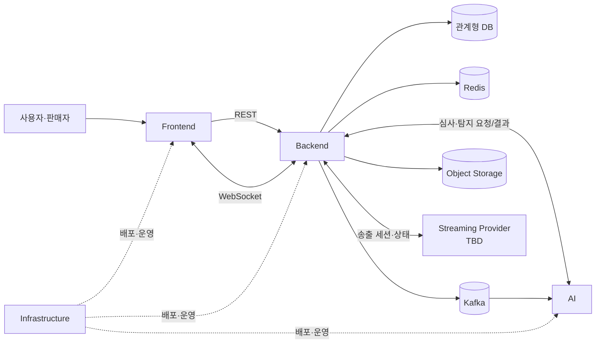

# System Architecture

> 상태: Draft
>
> 제품 원본: Google Sheet 명세서 7종
>
> 통합 설계: [`docs/design-docs/auction-platform.md`](docs/design-docs/auction-platform.md)

## 목적과 시스템 경계

DIB는 일반 경매와 세로형 Live 경매를 하나의 경매 코어로 제공한다. 이 저장소는 제품 목표, 컴포넌트 경계, 시스템 계약과 검증 기준을 관리하며 컴포넌트 내부 구현은 각 submodule이 소유한다.

| 컴포넌트 | 경로 | 책임 | 상세 문서 |
| --- | --- | --- | --- |
| Frontend | `components/frontend` | 일반 쇼핑몰형 경매 UI, Live 세로 피드, 판매자 방송·경매 제어 UI | `components/frontend/README.md` |
| Backend | `components/backend` | 인증·인가, 상품, 경매, 입찰, Live, 거래 API와 실시간 이벤트 | `components/backend/README.md` |
| AI | `components/ai` | 상품 등록 심사와 이상 거래 탐지 등 AI 기능 | `components/ai/README.md` |
| Infrastructure | `components/infra` | 실행 환경, 데이터·메시징·스토리지와 배포 구성 | `components/infra/README.md` |

## 논리 도메인

- 회원·권한: 익명, 회원, 판매자 역할에 따른 접근 제어
- 상품·심사: 상품 등록, AI 승인 상태, 경매 노출 가능 여부
- 경매 코어: `GENERAL`과 `LIVE`가 공유하는 입찰, 예치금, 연장, 낙찰·유찰 규칙
- 일반 경매: 예약 시작, 자동 종료, 홈 큐레이션, 목록·검색·상세
- Live: 방송 설정, 최대 10개 상품 라인업, 한 번에 하나인 상품 경매, 세로형 방송 피드
- 거래: 주문, 결제, 배송, 정산과 환불·몰수
- 행동·추천: 조회·체류·스킵·관심·입찰 이벤트와 일반 경매 추천/인기 산정
- 운영: 신고, 모니터링, 장애 상태와 관리자 조치

## 시스템 관계

실제 클라우드 토폴로지와 실행 명령은 `components/infra`가 소유한다. Streaming Provider와 최종 DB 엔진은 아직 결정되지 않았다.

## 핵심 흐름

### 일반 경매

AI 승인 상품을 판매자가 `GENERAL` 경매로 예약한다. 시작 전에는 수정·취소할 수 있고, 예약 시간이 되면 서버가 경매를 시작한다. 사용자는 쇼핑몰형 홈·목록·검색·상세에서 경매를 탐색하고 회원은 입찰한다. 종료 시각과 연장 규칙에 따라 자동 종료하고 낙찰 또는 유찰 처리한다.

### Live 경매

판매자가 방송 설정과 최대 10개 상품을 구성한 뒤 즉시 방송을 시작한다. 방송 중 판매자가 상품 하나의 경매를 수동 시작하며 동시에 진행되는 상품 경매는 하나뿐이다. 해당 경매가 끝나야 다음 상품 경매를 시작할 수 있고, 진행 중 경매가 없어야 방송을 종료할 수 있다. Live 피드는 현재 방송 중인 콘텐츠만 제공한다.

## 시스템 불변조건

- 모든 경매는 `auctionType=GENERAL|LIVE`로 구분하되 입찰·예치금·연장·낙찰 정책은 경매 코어에서 공유한다.
- 하나의 상품은 예약/진행 일반 경매와 진행 중 Live에 동시에 노출될 수 없다.
- Live 하나에는 최대 10개의 상품이 연결되고 활성 상품 경매는 최대 하나다.
- 익명 사용자는 일반 경매를 조회할 수 있다. Live에서는 영상, 현재 상품·경매 상태와 시청자 수만 볼 수 있다.
- 익명 사용자는 입찰, 관심, 채팅, 신고 등 상태 변경 활동을 할 수 없다.
- 입찰 상태 갱신은 원자적이어야 하며 같은 명령의 재전송은 중복 입찰을 만들지 않아야 한다.
- 마지막 30초 내 유효 입찰은 종료를 15초 연장하며 횟수 제한은 없다.
- 방송 장애 중에는 현재 상품 이미지(없으면 방송 커버)를 보여주고 진행 중 경매는 계속한다. 신규 상품 경매는 시작하지 않는다.

## 데이터와 일관성 경계

- 관계형 DB: 상품, 경매, 입찰, 예치금, 주문·결제·정산과 방송 구성의 영속 원본
- Redis: 경매 실시간 상태, 스케줄러 키, 캐시, Live presence와 복구 타이머
- Kafka: 경매·입찰·Live 상태 변경을 컴포넌트에 전달하는 버전 이벤트
- Object Storage: 상품·방송 이미지와 미디어 자산
- Streaming Provider: 영상 송출과 상태. 제품 정책과의 어댑터 경계는 Backend가 제공한다.

Redis와 Kafka는 DB의 영속 원본을 대체하지 않는다. 상태 변경은 도메인 트랜잭션을 먼저 확정하고, 이벤트 중복 소비와 재처리를 견딜 수 있어야 한다. 상세 키·이벤트·API 계약의 원본은 Google Sheet이며 저장소 요약은 [`docs/contracts/auction-platform.md`](docs/contracts/auction-platform.md)에 있다.

## 의존성 원칙

- 컴포넌트 내부 구현을 다른 컴포넌트가 직접 참조하지 않는다.
- 컴포넌트 간 통신은 명시적인 REST, WebSocket 또는 Kafka 계약을 사용한다.
- 인증·인가와 제품 불변조건은 클라이언트가 아니라 Backend에서도 강제한다.
- submodule 커밋은 검증된 시스템 조합을 표현한다.

## 미결정 사항

- Streaming Provider, 송출 프로토콜과 복구 신호
- 추천 경매와 인기 경매의 점수 공식
- 최종 물리 ERD, DB 엔진, 인덱스와 제약 조건
- 관측성 지표·경보, 배포 주소와 컴포넌트별 실행 명령
- Live 장애 복구 5분 타이머의 정확한 시작·해제 이벤트
