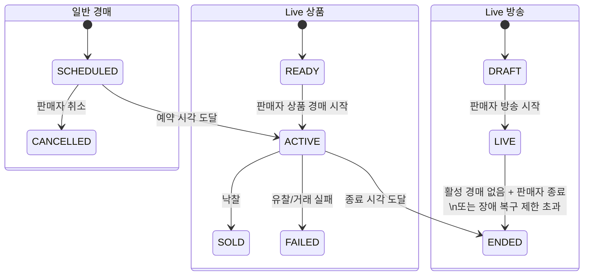

# 통합 경매 플랫폼 설계

> 상태: Draft
>
> 최근 검토: 2026-09-07
>
> 상세 제품·API 계약 원본: Google Sheet 명세서 7종
>
> 입력 ERD: `dib.sql` 초안(완성본 아님)

## 1. 목적

일반 경매와 Live 경매를 별도 사용자 경험으로 제공하면서 입찰·예치금·연장·종료 정책은 하나의 경매 코어에서 일관되게 집행한다. 이 문서는 컴포넌트가 함께 지켜야 할 논리 설계이며 물리 스키마나 내부 클래스 구조를 확정하지 않는다.

## 2. 결정 사항

| 주제 | 결정 |
| --- | --- |
| 경매 구분 | 공통 Auction에 `GENERAL`, `LIVE` 타입을 둔다. |
| 일반 탐색 | 쇼핑몰형 홈(추천/마감임박/인기), 전체 목록·검색·상세를 제공한다. |
| 일반 생명주기 | 예약 생성 후 서버가 자동 시작·종료한다. 시작 전만 수정·취소할 수 있다. |
| Live 탐색 | 세로 스크롤 피드에는 현재 방송 중인 Live만 노출한다. |
| Live 구성 | Live 하나에 상품 최대 10개, 동시에 활성인 상품 경매는 하나다. |
| Live 진행 | 방송과 상품 경매는 판매자가 수동 시작하며 다음 상품도 수동 시작한다. 예약 방송은 없다. |
| Live 종료 | 진행 중 상품 경매가 없을 때만 방송을 종료할 수 있다. |
| 익명 권한 | 일반 경매 조회는 허용한다. Live는 영상·현재 상태만 허용하고 채팅·입찰 등 활동은 금지한다. |
| 상품 배타성 | 상품은 예약/진행 일반 경매와 진행 중 Live에 동시에 노출할 수 없다. |
| 장애 | 영상 장애에도 진행 중 경매는 계속하고 이미지로 대체한다. 신규 상품 경매 시작은 차단한다. |

## 3. 논리 모델

- Product: 판매 대상과 AI 심사 결과를 가진다. 승인된 상품만 경매에 배치할 수 있다.
- Auction: 타입, 판매자, 상품, 가격, 시간, 상태를 가진 공통 경매 집합체다.
- Bid / BidDeposit: 입찰 내역과 최초 입찰 예치금을 관리한다.
- LiveBroadcast: 방송 설정, 커버, 송출 상태와 방송 생명주기를 관리한다.
- LiveItem: 방송 안의 상품 순서와 상품별 경매 설정을 연결한다.
- Order / Payment / Settlement: 낙찰 이후 거래와 정산을 관리한다.
- BehaviorEvent: 회원 및 익명 세션의 탐색 행동을 추천·분석용으로 기록한다.

`LiveBroadcast 1:N LiveItem`, `LiveItem 1:1 Product`, `LiveItem 0..1:1 Auction` 관계를 목표 논리 구조로 사용한다. 동일 Product의 활성 노출 배타성은 DB 제약만이 아니라 도메인 잠금/트랜잭션으로 보장한다.

## 4. 상태 모델

`READY`, `SOLD`, `FAILED`는 구현 협의를 위한 목표 논리명이다. 최종 DB enum과 API 값은 상세 명세와 물리 ERD를 확정할 때 맞춘다.

## 5. 주요 처리 흐름

### 5.1 일반 경매 생성과 실행

1. 판매자와 상품 소유권, AI 승인 상태를 확인한다.
2. 상품에 예약/진행 일반 경매나 진행 Live 노출이 없는지 잠근 상태로 확인한다.
3. 예약 경매와 시작·종료 스케줄 키를 함께 등록한다.
4. 시작 시 경매를 `ACTIVE`로 바꾸고 조회 캐시 및 이벤트를 갱신한다.
5. 유효 입찰이 종료 30초 이내에 들어오면 종료 시각을 15초 연장하고 스케줄 버전을 교체한다.
6. 확정된 종료 시각에 한 번만 낙찰/유찰 처리한다.

### 5.2 Live 준비와 진행

1. 판매자가 방송 설정과 승인된 상품 최대 10개를 구성한다.
2. 송출 세션을 준비하고 방송을 `LIVE`로 시작한다.
3. 판매자가 `READY` 상품을 선택해 즉시 `LIVE` 경매를 시작한다.
4. 서버는 활성 상품 경매가 이미 있으면 요청을 거절한다.
5. 경매 종료 후 결과를 반영하고 판매자가 다음 상품을 수동 시작한다.
6. 활성 상품 경매가 없을 때 판매자가 방송을 종료한다.

### 5.3 입찰

1. 인증, 판매자 본인 여부, 현재 최고 입찰자 여부와 경매 상태를 검사한다.
2. 첫 입찰이면 입찰액의 10%(최소 1,000원) 예치금 조건을 확인한다. 이후 추가 충전은 하지 않는다.
3. 최소 1,000원 이상 증가한 입찰만 허용한다.
4. Redis의 현재 최고가를 원자적으로 갱신하고 영속 입찰 및 이벤트를 기록한다.
5. 같은 `commandId` 재시도는 기존 결과를 돌려주며 중복 입찰을 만들지 않는다.

### 5.4 Live 송출 장애

1. 송출 상태를 `DEGRADED`로 전환하고 현재 상품 이미지, 없으면 방송 커버를 표시한다.
2. 진행 중 경매의 입찰·타이머·종료는 계속한다.
3. 장애 상태에서는 신규 상품 경매 시작을 차단한다.
4. 진행 중 경매 종료 또는 경매가 없어진 시점부터 복구 제한 타이머를 적용한다.
5. 5분 안에 복구되지 않으면 방송을 자동 종료한다. 타이머 시작·해제의 공급자 이벤트 매핑은 TBD다.

## 6. 일관성·동시성

- 상품 배치: `productId` 기준 잠금 또는 동일 효과의 원자 조건으로 중복 노출을 막는다.
- Live 활성 경매: `liveBroadcastId`당 활성 Auction이 하나 이하가 되도록 트랜잭션 조건과 조회 최적화를 함께 둔다.
- 최고 입찰가: 비교와 갱신을 하나의 원자 연산으로 수행한다.
- 멱등성: 입찰 명령은 `commandId`, 비동기 소비는 이벤트 ID로 중복 처리하지 않는다.
- 이벤트 순서: 경매 단위 이벤트는 `auctionId`를 Kafka 파티션 키로 사용한다.
- 스케줄 경쟁: 시작·종료 작업은 상태와 스케줄 버전을 함께 확인하여 오래된 작업을 무시한다.
- 영속성: DB를 거래 상태의 원본으로 두고 Redis 캐시는 재구성할 수 있어야 한다.

## 7. 인증·개인정보 경계

| 기능 | 익명 | 회원 | 판매자(본인) |
| --- | --- | --- | --- |
| 일반 경매 목록·검색·상세 | 허용 | 허용 | 허용 |
| 일반 경매 입찰 내역 | 마스킹 조회 | 마스킹 조회 | 마스킹 조회 |
| Live 영상·현재 상품·상태·시청자 수 | 허용 | 허용 | 허용 |
| Live 상품 상세·입찰 내역·채팅 | 금지 | 허용 | 허용 |
| 관심·입찰·신고 | 금지 | 허용 | 허용(자기 경매 입찰 제외) |
| 방송 설정·상품 경매 시작·방송 종료 | 금지 | 자신의 방송만 | 자신의 방송만 |

익명 Live 행동은 `IMPRESSION`, `VIEW_START`, `DWELL`, `SKIP`만 기록한다. 식별자는 회원 ID가 아니라 익명 세션/기기 범위의 식별 전략을 사용해야 하며 개인정보 보관 정책은 별도 확정한다.

## 8. 초안 ERD와 목표 설계의 차이

제공된 `dib.sql`은 참고용 초안이며 다음 항목을 확정한 뒤 마이그레이션 설계로 전환해야 한다.

| 초안 관찰 | 목표/필요 결정 |
| --- | --- |
| `auction`에 타입이 없고 `live_broadcast_id`가 필수 | `auction_type`을 추가하고 일반 경매에서는 Live 연결을 선택적으로 만든다. |
| 방송과 상품 순서를 나타내는 엔터티 없음 | 최대 10개, 순서, 경매 설정을 위한 `LiveItem` 구조가 필요하다. |
| 방송 상태에 `SCHEDULED`, `CANCELLED` 포함 | 예약 방송 없는 `DRAFT → LIVE → ENDED` 정책과 정합화한다. |
| `product.status`가 등록/판매 중심 | AI 심사 상태와 경매 배치 가능 상태의 분리 여부를 결정한다. |
| 행동 이벤트의 `member_id`가 필수 | 익명 Live 행동을 위한 세션 식별 구조가 필요하다. |
| 예치금 상태가 대기/결제/환불 중심 | 몰수 상태 또는 몰수 이력 표현을 확정한다. |
| 관심 엔터티가 Auction을 참조 | 상품 관심인지 경매 관심인지 상세 명세와 통일한다. |
| 여러 SQL 방언 타입이 혼재 | 최종 DB 엔진, enum/json/vector 타입과 인덱스를 확정한다. |

초안의 오탈자와 세부 제약도 물리 ERD 확정 시 별도 검증한다. 이 문서만으로 기존 DB를 자동 변경하지 않는다.

## 9. 계약과 버전

REST, WebSocket, Kafka, Redis, 오류 코드의 상세 열 정의와 행은 Google Sheet가 원본이다. 구현자는 [`docs/contracts/auction-platform.md`](../contracts/auction-platform.md)의 경계 요약과 Sheet 원본을 함께 확인한다. 하위 호환이 깨지는 이벤트 또는 API 변경은 새 버전을 사용하고 소비자 준비 상태를 실행 계획에 기록한다.

## 10. 미결정 사항

- 추천/인기 경매 점수, 갱신 주기와 콜드스타트 정책
- Streaming Provider 및 송출 세션·복구 webhook 계약
- 물리 ERD, DB 엔진, 데이터 보관·삭제 정책
- 결제 실패, 낙찰자 미결제와 예치금 몰수의 상세 상태 전이
- Live 익명 세션 식별·보관 기간
- 운영 지표, SLO와 경보 임계값
